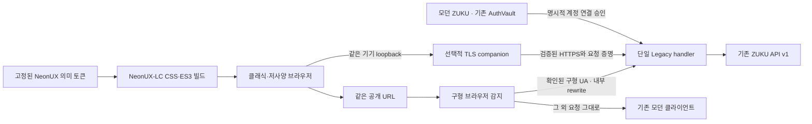

# 구조와 파편화 방지

ZUKU Legacy는 **기존 공개 URL에서 구형 브라우저를 감지해 선택하는 렌더러**다. 별도 Legacy 주소로 이동하거나 다른 플랫폼에 가입할 필요가 없다. 기존 `/api/v1`의 계정·콘텐츠·게시글·권한을 서버에서 호출하고, 같은 데이터를 클래식 브라우저용 HTML로 표현한다.

직접 브라우저 연결은 전송 방식에 따라 공개 열람 또는 인증 기능을 제공한다. 브리지는 네트워크 전송만 보완하며 새로운 계정·콘텐츠 모델을 만들지 않는다.

## 같은 URL, 자동 선택

공통 `isClassicUserAgent`, `publicToLegacyPath`, `legacyToPublicPath`가 UA 판정과 경로 변환의 단일 원본이다. Next proxy는 확인된 구형 브라우저의 지원 경로만 내부 rewrite한다. 모던·알 수 없는 UA는 `NextResponse.next()`로 기존 라우팅에 넘긴다. 구형 판정을 기본값으로 삼거나 임의의 모던 요청을 낮은 사양 UI로 바꾸지 않는다.

| 공개 경로 | 내부 렌더러 경로 |
| --- | --- |
| `/` | `/legacy` |
| `/community` | `/legacy/thread` |
| `/community/:id` | `/legacy/thread/:id` |
| `/login` | `/legacy/connect` |
| `/profile` | `/legacy/account` |
| 상품 채널·`/search`·`/content/:id`·`/profile/:handle` | 같은 경로 앞에 `/legacy` 추가 |

query와 원래 공개 경로를 보존하고 화면의 링크·페이지 이동·검색 결과에도 공개 경로를 사용한다. 자산, 쓰기 action, 계정 승인 API는 내부 `/legacy`에 남는다. 명시적으로 `/legacy`를 여는 것은 디버깅·통합 확인용이며 일반 진입 흐름이 아니다.

같은 URL에 다른 표현이 존재하므로 응답은 `Vary: User-Agent`를 유지해야 한다. CDN·역방향 프록시도 이 구분을 존중하고 인증 응답의 `no-store`를 무시하지 않아야 한다. 내부 rewrite 경로 표시를 인증 증거로 사용하지 않는다.

독립 서버는 모던 앱을 포함하지 않는다. 확인된 구형 UA의 공개 경로는 직접 처리하고, 모던·알 수 없는 UA의 공개 GET/HEAD는 같은 경로의 `ZUKU_MODERN_ORIGIN`으로 302 이동한다. Next 통합은 이 이동 없이 같은 호스트의 기존 모던 렌더러를 유지한다. 이 두 동작을 혼동하지 않는다.

전용 Classic 호스트는 `ZUKU_FORCE_CLASSIC=1`로 이 handoff를 끈다. `ie.zuzunza.com`의 모든 제품은 별도 호스트가 아니라 `/hype`, `/swipe`, `/vine`, `/vive`의 canonical path로 표현한다. 이 정책은 신뢰된 서버 설정이며 요청 헤더로 켤 수 없다.

## 패키지 경계

| 위치 | 책임 | 두지 않는 기능 |
| --- | --- | --- |
| `packages/legacy-core` | API adapter, SSR 화면, HTML form action, pairing·CSRF·세션 정책 | 신규 사용자 DB, 독립 콘텐츠 저장소, 다른 권한 체계 |
| `packages/neonux-lc` | 기존 NeonUX 토큰을 CSS2/ES3로 출력, DOM/canvas/VML의 선택적 표현 | 로그인, API client, router, 암호화, 브라우저 상태 저장소 |
| `packages/bridge` | 공통 UA·경로 선택, 같은 기기 loopback, 검증된 TLS, 요청 증명, upstream cookie jar | 임의 프록시, TLS downgrade, 미디어 변환, 브라우저 암호화 |
| `apps/server` | standalone 서버와 실제 연결 정보를 handler에 전달 | 별도 화면·업무 로직 |
| `examples/next` | 기존 Next 앱에 같은 handler와 모던 승인 화면을 연결하는 예제 | 모던 AuthVault의 복제 |

`createLegacyApp(options)`가 반환하는 `handle(Request, RequestContext)`가 유일한 요청 처리 진입점이다. Node/Bun 서버 adapter와 Next Route Handler는 요청·응답 및 신뢰된 연결 정보만 변환한다. Next에서 별도의 Legacy React 앱을 hydration하지 않는다. Next의 Route Handler는 표준 Request/Response 기반이므로 이 경계와 맞는다. [Next.js Route Handlers](https://nextjs.org/docs/app/getting-started/route-handlers).

core가 Node의 crypto와 파일 시스템을 사용하므로 Next에서는 Node runtime을 선택한다. Edge runtime을 지원한다고 가정하지 않는다. Bun은 이 경계를 재사용하는 실행 환경이며, 특정 Bun 버전에서의 검증 기록 없이 지원 완료로 표시하지 않는다.

## 하나의 API 계약

`contracts.ts`는 기존 wire 응답의 필요한 필드를 표현한다. `api.ts`의 메서드만 upstream 경로를 선택한다. 브라우저가 지정한 임의 URL·Authorization·cookie·forwarded 헤더를 API에 전달하지 않는다.

- 피드·검색·콘텐츠·댓글·Thread·프로필·보관함이 기존 `/api/v1`을 사용한다.
- Vive/Vine의 `items`, `has_more` 응답은 화면의 공통 pagination에만 맞춘다. 새로운 저장 모델을 만들지 않는다.
- 페이지는 12개 단위이며 API 응답은 1 MiB, 기본 timeout은 8초다. 예기치 않은 redirect를 따라가거나 token을 다른 origin으로 넘기지 않는다.
- 쓰기 동작은 기존 posts, replies, likes, bookmarks, comments API를 호출한다. 서버의 권한·제한 응답이 그대로 결과를 결정한다.
- 렌더링은 사용자 문자열을 이스케이프하며 임의 원격 HTML을 삽입하지 않는다. 화면 표현을 위한 축약은 플랫폼 권한의 대체제가 아니다.

API에 새 기능이 생기면 먼저 이 공통 adapter의 계약과 오류 처리에 추가한다. Next와 standalone 서버에 동일한 로직을 각각 구현하지 않는다. 안전하게 클래식 UI로 표현할 수 없는 기능은 모던 화면으로 이어주고 [기능 표](features.md)에 명시한다.

## 하나의 디자인 원본

NeonUX-LC의 원본은 [`neonux-core`](https://github.com/NiSeullent/neonux-core)의 고정 commit `fbb3840af0076c580680fe9d8b90cf50a639ddc7`, slate dark 테마다. 정확한 경로와 commit은 `packages/neonux-lc/vendor/source.json`에 기록한다.

빌드는 snapshot의 의미 토큰을 해석해 필요한 값만 CSS와 ES3에 삽입한다. `dist/token-map.json`에 사용한 값을 남기며 해석하지 못한 modern 표현식은 빌드를 실패시킨다. 최신 upstream을 자동 추종하거나 Legacy만의 임의 fallback 색상을 조용히 추가하지 않는다. 업데이트는 commit 변경 → snapshot 동기화 → token diff 검토 → 재현성·화면 검증 순서로 진행한다.

공유 대상은 의미 토큰과 API 계약이다. 모던 React 컴포넌트 전체를 오래된 브라우저로 억지 이식하거나 독립 디자인 시스템으로 복사하지 않는다. NeonUX-LC는 기본 문서와 작은 장식만 제공한다.

## 로그인과 배포 수명

모던 승인 화면과 Legacy handler는 같은 pairing 저장소에 도달해야 한다. 기존 모던 호스트에 자동 선택 proxy, 내부 handler와 `/legacy/approve`를 함께 설치한다. 구형 브라우저의 계정 연결 진입점은 공개 `/login`이다. 기존 AuthVault에서 얻은 access token은 승인 API에만 전달하고 이후 Legacy 서버에 보관한다. 로그인·패스키·CAPTCHA·refresh 체계를 복제하지 않는다.

Legacy 전용 `zuku_lc_session` 쿠키는 공개 URL에서도 전달되도록 `Path=/`를 사용한다. 기존 모던 인증 쿠키의 이름·값·수명을 수정하지 않는다. 이 저장소의 통합 예제는 기존 모던 프로젝트나 운영 배포를 직접 변경하지 않으며, 실제 호스트에 선택적으로 통합해야 자동 분기가 활성화된다.

현재 상태 저장소와 replay cache는 단일 프로세스를 전제로 한다. `LegacyState`는 세션·pairing·CSRF를 대체할 수 있는 인터페이스이지만 **그 인터페이스를 구현하는 것만으로 다중 worker를 지원하지는 않는다.** core 내부 replay cache와 limiter까지 공유·원자화해야 한다. 현재 replay store는 `createLegacyApp` 옵션으로 주입할 수 없으므로 production 운영도 하나의 verifier worker로 제한한다. autoscaling·serverless 다중 인스턴스 배포는 이 작업 후 검증해야 한다.

브리지 설정·운영 위험은 [보안 모델](security.md), 실제 브라우저 검증 여부는 [호환성 문서](compatibility.md)를 따른다.
