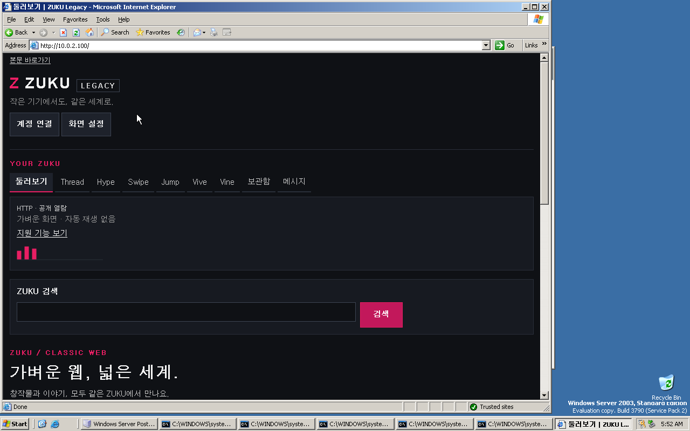

# 실제 IE6 VM 검증 기록

2026-09-08 UTC, Microsoft 공식 평가판 설치 이미지로 새 VM에 Windows Server 2003 SP2를 설치했다. **실제 IE 6.0.3790.3959에서 여섯 화면·설정 조건의 탐색, 한글 검색 양식, 메뉴 줄바꿈과 가로 넘침 검사를 통과했다.** 스크립트를 켠 조건에서는 NeonUX-LC의 실제 VML 표면과 도형을 확인했다. 이 결과를 모든 IE6 환경의 호환 인증으로 해석하지 않는다.

검증 대상은 Windows Server 2003 계열에 포함된 실제 IE6이다. Windows XP, 다른 IE6 서비스 팩, 실제 구형 하드웨어는 이 VM의 결과만으로 검증되지 않는다. 전체 지원 범위와 별도 출시 조건은 [호환성 문서](compatibility.md)를 따른다.

## 설치 이미지와 브라우저 근거

설치 이미지는 [Microsoft 공식 CDN의 X13-04874.img](https://download.microsoft.com/download/5/1/C/51C53A00-7F8B-423C-A841-8B9C49B910BF/X13-04874.img)이며, Windows Server 2003 R2 Standard Edition with Service Pack 2 평가판의 x86 설치 CD1이다. 2026-09-08에 HTTPS 다운로드 응답과 실제 파일을 확인했다.

| 항목 | 확인값 |
| --- | --- |
| 파일 크기 | 623,075,328바이트 |
| ISO9660 볼륨 이름 | `CRMSEVL_EN` |
| SHA-256 | `5d3e3b4e4f46067032f4b61cccc9472e8eaed88490cb3f9800fc9a32f530e409` |
| 설치 매체의 `iexplore.exe` | PE FileVersion `6.0.3790.3959` |
| 설치 매체의 `mshtml.dll` | PE FileVersion `6.0.3790.3959` |
| 설치 매체의 `shdocvw.dll` | PE FileVersion `6.0.3790.3959` |

브라우저 버전은 ISO9660 디렉터리에서 `I386/IEXPLORE.EX_`, `I386/MSHTML.DL_`, `I386/SHDOCVW.DL_`를 읽고 압축 해제한 뒤 PE 버전 정보를 확인한 값이다. 다운로드 파일의 SHA-256은 로컬 계산값이며, Microsoft가 따로 게시한 서명이나 체크섬과 대조했다는 뜻은 아니다. 설치 후에도 COM으로 실행한 실제 IE 인스턴스와 설치된 파일 버전을 확인했다. `iexplore.exe`와 `mshtml.dll`은 모두 `6.0.3790.3959`, 커널은 `5.2.3790.3959`, 페이지의 JScript와 호스트 VBScript는 `5.6.8832`였다. 모든 검사 페이지는 `CSS1Compat` 문서 모드였다.

## 평가판 설치 조건

해당 설치 이미지 내부의 `I386/EULA.TXT`는 내부 평가 용도, 설치 후 180일의 평가 기간, 설치 과정에서 안내하는 정품 인증 절차를 명시한다. 설치 프로그램이 제공하는 제품 키 후입력 선택으로 정상 설치했고, 첫 로그인 화면에서는 **인증까지 14일 남음**을 확인했다. 현재 검증은 이 정상 유예 기간 안에서 수행한다. 날짜 변경이나 인증 우회로 기간을 연장하지 않는다. CD2의 R2 추가 서버 구성 요소는 설치하지 않았으며, 실제 게스트는 Windows Server 2003 Standard SP2다.

이 조건은 사전 설치된 [Windows Server 2003 R2 Enterprise VHD 평가판](https://www.microsoft.com/en-ie/download/details.aspx?id=19727)의 조건과 다르다. 그 VHD에는 별도의 사용 기간과 인증 금지 조항이 포함되어 있어, 이 검증에서는 공식 설치 CD로 빈 디스크에 새로 설치한다. 운영체제 파일, 가상 디스크, 제품 키, 비밀번호는 이 저장소에 포함하지 않는다.

## VM과 테스트 연결

| 항목 | 구성 |
| --- | --- |
| 가상화 | QEMU 10.1, KVM |
| 머신 | `pc-i440fx` |
| CPU / 메모리 | 1 vCPU / 1,024 MiB |
| 디스크 | 새 12 GiB `qcow2` 디스크 |
| 시계 | 호스트의 현재 UTC 시각, 과거 날짜로 변경하지 않음 |
| 게스트 시간대 | GMT, 일광 절약 시간 사용 안 함 |
| 언어 지원 | 설치 매체의 동아시아 언어 파일 설치, 미국 영문 키보드 |
| 가상 NIC | `rtl8139` |
| 네트워크 | QEMU user networking, `restrict=on` |
| 명시적 게스트 연결 | `10.0.2.100:80` → 호스트 `127.0.0.1:18787` |
| 테스트 서버 | [fixture-server.mjs](../scripts/vm/fixture-server.mjs) |
| 콘솔 제어 | [QMP 도구 안내](../scripts/vm/README.md) |

테스트 서버는 호스트의 루프백 주소에만 바인딩하고, 정해진 테스트 데이터로 응답한다. 실제 ZUKU API나 운영 계정에 연결하지 않는다. VM의 일반 외부 연결은 제한하고 위 게스트 전달 경로만 테스트에 사용한다.

빌드 후 저장소 루트에서 테스트 서버를 실행한다.

```sh
node scripts/vm/fixture-server.mjs
```

게스트 IE6에서는 `http://10.0.2.100/`를 연다. `/`, `/community` 등 같은 공개 경로에서 구형 브라우저 감지와 Classic 화면 선택을 확인하며, `/legacy` 직접 진입을 사용자 동선으로 사용하지 않는다. QMP 안내의 입력 예제를 사용할 때에도 이 VM의 주소를 입력한다.

이 HTTP 연결은 격리된 VM의 익명·읽기 전용 화면 검증용이다. 실제 사용자 로그인이나 통신 보안 검증을 대신하지 않는다. Server 2003의 Internet Explorer Enhanced Security Configuration이 적용될 수 있으므로, 테스트 시 적용된 보안 영역과 스크립트 설정을 결과에 함께 기록한다.

## 실제 엔진 실행 결과

Internet Explorer Enhanced Security Configuration은 기본 Internet 영역의 스크립트를 차단했다. 테스트 전용 `http://10.0.2.100`만 Trusted sites에 등록하고 IE를 다시 실행했다. 다음 표의 활성 조건은 해당 영역의 Active scripting이 Enable인 상태다. 비활성 조건은 Internet Options → Security → Trusted sites → Custom Level에서 **Active scripting을 Disable로 실제 변경**한 뒤 IE를 다시 실행했다. 마지막에는 원래 Enable 설정으로 복원하고 1024px 검사를 다시 통과했다. 일반 외부 네트워크 제한은 그대로 유지했다.

각 실행은 홈, Thread, 직접 검색, 작품, 로그인 안내, 텍스트 모드 페이지를 검사하고, 실제 HTML 검색 양식에 `한글`을 넣어 GET 제출했다. 실제 요청의 `%ED%95%9C%EA%B8%80`과 검색 결과 제목을 확인했다. 로그인 화면은 보호되지 않은 HTTP에서 계정 기능이 제한된다는 안내를 검사했으며, 운영 인증이나 쓰기를 수행하지 않았다.

| IE 창 외부 폭 | 실제 문서 폭 | View → Text Size | Active scripting / 모드 | 결과·기록 |
| --- | --- | --- | --- | --- |
| 320px | 292px | Medium | Enable / auto | [PASS, 153개 assertion](evidence/ie6-2026-09-08/320-medium.txt) |
| 480px | 452px | Medium | Enable / auto | [PASS, 153개 assertion](evidence/ie6-2026-09-08/480-medium.txt) |
| 800px | 772px | Medium | Enable / auto | [PASS, 153개 assertion](evidence/ie6-2026-09-08/800-medium.txt) |
| 1024px | 996px | Medium | Enable / auto | [PASS, 153개 assertion](evidence/ie6-2026-09-08/1024-medium.txt) |
| 320px | 292px | Largest | Enable / auto | [PASS, 153개 assertion](evidence/ie6-2026-09-08/320-largest.txt) |
| 320px | 292px | Medium | Disable / text | [PASS, 117개 assertion](evidence/ie6-2026-09-08/320-script-disabled.txt) |

모든 실행의 실패·경고는 0개다. 모든 검사 페이지에서 `documentElement.scrollWidth`와 `body.scrollWidth`가 실제 문서 폭을 넘지 않았다. 짧은 메뉴 항목은 같은 높이로 유지됐으며, 부족한 공간에서는 항목 전체가 다음 줄로 이동했다. Largest 조건에서 실제로 발생했던 `Swipe`와 `메시지`의 글자 단위 분리를 `white-space: nowrap`으로 수정하고 재검증했다. 이 설정은 알려진 짧은 메뉴 이름에만 적용하며, 사용자 콘텐츠의 긴 단어 감싸기는 유지한다.

스크립트 활성 페이지는 NeonUX-LC `0.1.0`과 VML 표면 1개·하위 도형 5개를 실제 DOM에서 관찰했다. 텍스트 모드에서는 스크립트 요소가 0개이고 내부 탐색·검색 후에도 `mode=text`를 유지했다. React·Next 부트스트랩은 관찰되지 않았다.

검증한 CSS·JS의 공통 내용 해시(두 파일 사이 NUL 구분)는 `29d5ca5f9fbb41b42e47a3ac8d06c55e809e9258427b1d3038210316aace96e0`이다. VBS 보고서는 게스트에서 UTF-16LE로 생성되며, 저장소의 보고서는 격리된 fixture로 전달한 UTF-8 표현이다. 스크린샷은 실제 게스트의 전체 프레임버퍼이며 브라우저 화면을 합성하지 않았다.



[320px 창·Largest 글자 스크린샷](evidence/ie6-2026-09-08/320-largest.png) · [Active scripting Disable 설정 스크린샷](evidence/ie6-2026-09-08/active-scripting-disabled.png)

## 재실행과 남은 범위

[네이티브 probe](../scripts/vm/ie6-probe.vbs)를 게스트에 복사해 다음과 같이 실행한다. 너비는 IE 창 외부 폭이다. 확대 및 보안 정책은 먼저 IE UI에서 선택하고 기록한다. probe 자체는 보안 설정을 바꾸지 않는다.

```bat
cscript //nologo C:\qa\ie6-probe.vbs C:\qa\ie6-report.txt 320 auto
cscript //nologo C:\qa\ie6-probe.vbs C:\qa\ie6-report.txt 320 text
```

Windows XP 자체, 다른 IE6 버전, 보호된 계정·쿠키·쓰기, CSS 완전 비활성, VML만 비활성인 정책, 전체 키보드 탐색과 보조공학, 실제 저사양 하드웨어의 지연·메모리는 아직 검증하지 않았다. Node 22 브리지를 XP에서 실행할 수 있다는 증거로 이 VM을 사용하지 않는다. Chromium의 8개 기본 화면 및 미디어 query를 제거한 9개 레이아웃 검사도 이 실제 엔진 결과와 구분한다.
